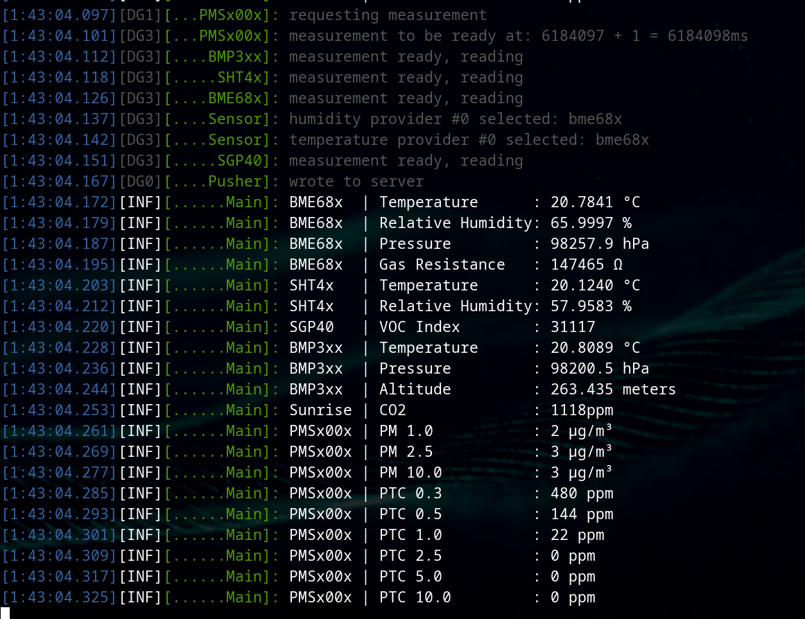
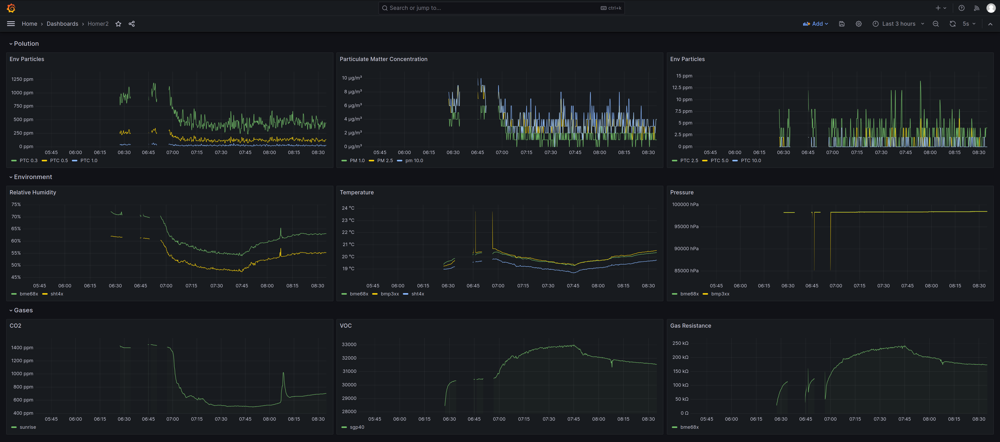

## What?

Homer2, running on a Raspberry Pi Pico, reads air quality monitoring sensors and sends 
the readings to Victoria Metrics, and finally graphs them on Grafana.

Raspberry Pi Ansible configuration also included (for Grafana and Victoria Metrics).

Sensors:

- BME68x
- BMP3xx
- PMS5003 or PMS7003
- SGP40
- SHT4X
- Senseair Sunrise

## How?

1. Clone this project.
2. Setup Raspberry Pico SDK locally.
3. Build the project. Example:

   ```bash
   # You need to put your actual Wifi name, password and your own country code here.
   # You need to put your raspberry PIs DDNS address here, connecting directly to IPs is planned.
   cmake -DWIFI_SSID="your_wifi_name" \
         -DWIFI_PASSWORD="your_wifi_password" \
         -DWIFI_COUNTRY="DE" \
         -DHOMER2_VICTORIA_ADDR="ip_address__OR__your_raspberry_pi_DDNS_address"
         -DHOMER2_VICTORIA_PORT=4242
   ```
4. Flash the image to Pico (I transfer the image to a Raspberry PI and flash from there,
   faster than usb-ip, safer than connecting Pico to my PC):

   ```bash
   # You need to adjust YOUR_OPEN_OCD_PATH_HERE to wherever you installed openocd.
   # You need to adjust PATH_TO_BUILD to the path of the project's directory.
   sudo openocd \
         -f /YOUR_OPEN_OCD_PATH_HERE/openocd/share/openocd/scripts/interface/cmsis-dap.cfg \
         -f /YOUR_OPEN_OCD_PATH_HERE/openocd/share/openocd/scripts/target/rp2040.cfg \
         -c "adapter speed 20000" \
         -c "program PATH_TO_BUILD/build/homer2.elf verify reset exit"
   ```

5. Connect the sensors to the pins you configured in [configs](./src/homer2_config.h.in).
   All I2C sensors go to the same pins. PMS5003 goes to UART 1 pins, again configured
   in [configs](./src/homer2_config.h.in).
6. Connect the power to Pico and see the readings in serial console or on
   grafana.
7. Import the Grafana [dashboard](./rpi/homer2_grafana_dashboard.json) into Grafana. Currently,
   this is a manual process, later to be added to Ansible.

## Configuration 

All the configurable options can be found in [configs](./src/homer2_config.h.in):

If you don't want pico to connect to Wi-Fi or write to Victoria Metrics,
set `HOMER2_WIFI` to `false`.<br>

To disable Unicode characters on serial console output,
set `HOMER2_CONSOLE_UTF` to `false`.<br>

You can disable any of the sensors if you don't have them:
- `HOMER2_SENSOR_ENABLED_SGP40 false`
- `HOMER2_SENSOR_ENABLED_SHT4X false`
- `HOMER2_SENSOR_ENABLED_BMP3XX false`
- `HOMER2_SENSOR_ENABLED_BME68X false`
- `HOMER2_SENSOR_ENABLED_SUNRISE false`
- `HOMER2_SENSOR_ENABLED_PMSX00X false`

## Where to get sensors from?

I bought almost all of them from Amazon, only from Adafruit or Sparkfun (sensors
from other cheaper vendors produced inaccurate results or didn't work at all).

Senseair/Sunrise was available from Digikey.

## ROADMAP

- e-paper display (Waveshare).
- Make it power consumption friendly.
- Sensors calibration.
- Allow connecting to IPs directly.
- Build a housing (WIP).

## History

[Homer1](https://github.com/hkoosha/homer1) ran on ESP32, Homer2 is a port to raspberry pi pico.

## Screenshots

Serial output (after running for ~1.5 hour):
<br>



<br>
<br>

Grafana:
<br>



<br>

